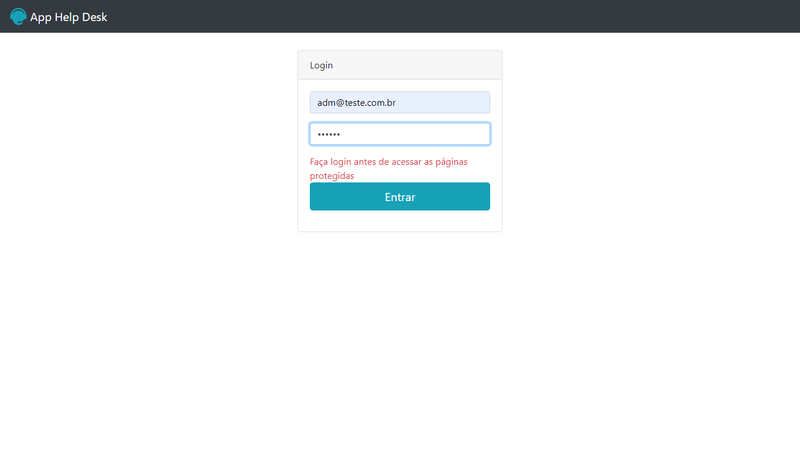
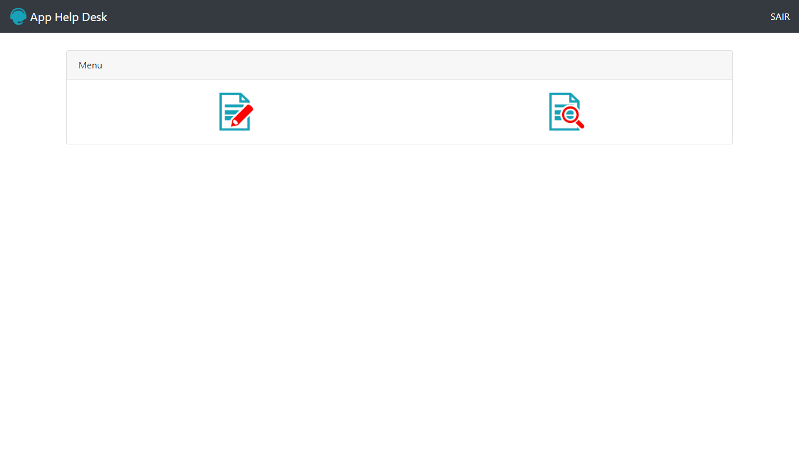
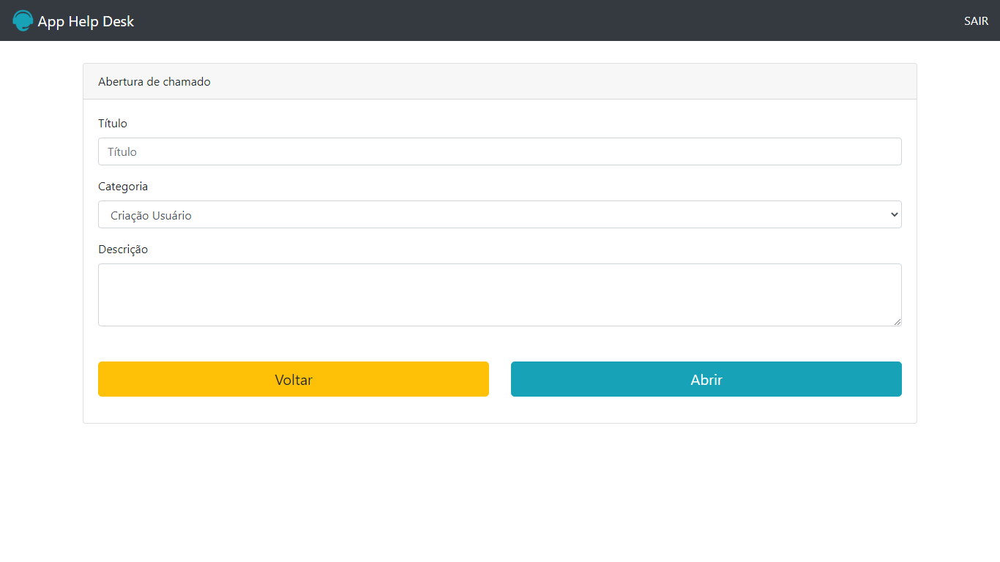

# App-Help-Desk

Aplicação para cadastrar perguntas (Tipo Yahoo resposta)

## Recursos

* O aplicativo é blog que você pode postar novas perguntas.
* O aplicativo foi desenvolvido com JavaScript, CSS, HTML e PHP com MySQL.

## Uso

1. Clone o repositório do GitHub.
2. Abra o projeto no seu editor de código.
3. Você precisar ter O XAMPP para o funcionamento do projeto, depois de instalado passar os arquivos para pasta htdocs.
4. Após a instalação do backend, basta iniciar o servidor apache e começar a usar a aplicação.

## Créditos

Este projeto foi criado por Alaska Websites.

